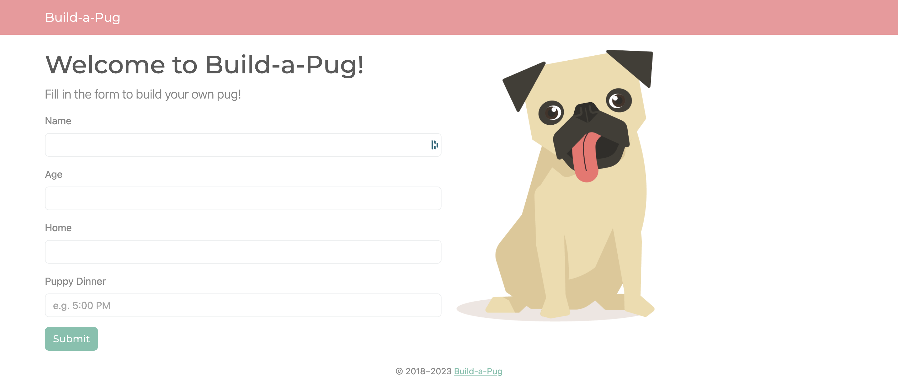

# Example Code for Testing Strategies for Python

This example code uses Python's [unittest](https://docs.python.org/3/library/unittest.html?highlight=discover#) to demonstrate how to use the bultin framework to write and run unit tests for a simple pug class. The app runs with [Flask](https://flask.palletsprojects.com/en/2.3.x/quickstart/) with [Bootstrap-Flask](https://bootstrap-flask.readthedocs.io/en/stable/) (using the [Bootswatch Minty theme](https://bootswatch.com/minty/)) and incorporates the [OpenAI API](https://platform.openai.com/).

## Prerequisites

* [pipenv](https://pipenv.pypa.io/en/latest/): `pip install pipenv --user`
* [OpenAI API key and organization](https://openai.com/blog/openai-api)
* Python 3+

## Setup

1. Activate virtual environment: `pipenv shell`
2. Install dependencies from Pipfile.lock: `pipenv install`
3. [Add environment variables](https://pypi.org/project/python-dotenv/#getting-started) by renaming `.env_template` to `.env` ...
4. ... and replacing placeholder secrets with real secrets
5. (Deactivate virtual environment: `exit`)

## Run tests

* To [discover](https://docs.python.org/3/library/unittest.html?highlight=discover#unittest.TestLoader.discover) and run the tests: `pipenv run tests`
* To execute a [coverage](https://coverage.readthedocs.io/en/7.3.1/index.html) static code analysis: `pipenv run coverage-analysis`
* To generage a coverage report: `pipenv run coverage-report`
* (See all available pipenv scripts: `pipenv scripts`)

## Run locally

1. ([Activate virtual environment](https://github.com/liz-acosta/testing-strategies-for-python/tree/main#setup))
2. [Spin up the server](https://flask.palletsprojects.com/en/2.3.x/quickstart/) from root directory: `flask run`
3. Navigate to `http://localhost:5000/` in your browser

It should look like this:

## Resources

* [Slide deck from PyBay 2023, 8 October 2023, San Francisco, CA](resources/202310_slide-deck_pybay-testing-strategies-for-python.pdf)
* [Video from PyBay 2023, 8 October 2023, San Francisco, CA](https://www.youtube.com/watch?v=HHR2YnWD0rw)
* [Using Python’s Built-in Tools for Unit Test Parameterization: A closer look at unittest's subTest()](https://dev.to/lizzzzz/using-pythons-builtin-tools-for-unit-test-parameterization-a-closer-look-at-unittest-subtest-12ca)

## Enjoy!
