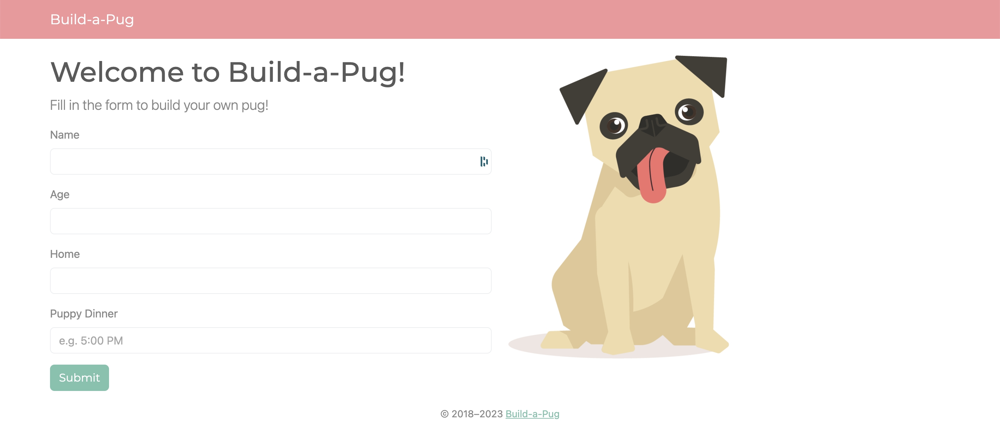

# Example Code for Testing Strategies for Python

This example code uses Python's [unittest](https://docs.python.org/3/library/unittest.html?highlight=discover#) to demonstrate how to use the builtin framework to write and run unit tests for a simple pug class. The app runs with [Flask](https://flask.palletsprojects.com/en/2.3.x/quickstart/) with [Bootstrap-Flask](https://bootstrap-flask.readthedocs.io/en/stable/) (using the [Bootswatch Minty theme](https://bootswatch.com/minty/)) and incorporates the [OpenAI API](https://platform.openai.com/).

## Prerequisites

* [pipenv](https://pipenv.pypa.io/en/latest/): `pip install pipenv --user`
* [OpenAI API key and organization](https://openai.com/blog/openai-api)
* Python 3+

## Setup

1. Install dependencies from Pipfile.lock: `pipenv install`
2. [Add environment variables](https://pypi.org/project/python-dotenv/#getting-started) by renaming `.env_template` to `.env` ...
3. ... and replacing placeholder secrets with real secrets
4. Initialize the [Sqlite](https://www.sqlite.org/index.html) database: `pipenv run init-db`
5. Optional: Delete the database: `pipenv run delete-db` 

## Run the app locally

1. To run the app locally: `pipenv run start-app`
2. Navigate to `http://localhost:5000/` in your browser

It should look like this:

## Run the tests

* To [discover](https://docs.python.org/3/library/unittest.html?highlight=discover#unittest.TestLoader.discover) and run the tests: `pipenv run tests`
* To execute a [coverage](https://coverage.readthedocs.io/en/7.3.1/index.html) static code analysis: `pipenv run coverage-analysis`
* To generate a coverage report: `pipenv run coverage-report`
* To run unit tests: `pipenv run pug-unit-tests`
* (To run tests with a specific test environment: `export TEST_ENV=stage` or `export TEST_ENV=prod` and then: `pipenv run pug-unit-tests`)
* (See all available pipenv scripts: `pipenv scripts`)

### Caveats and troubleshooting

**Broken images**

This version of the Build-a-Pug app saves each new pug created to a local Sqlite database. The pugs can then be viewed by navigating to `See Your Grumble` (which is what a group of pugs is called). Because OpenAI provides access to generated images for a limited duration, depending on when you view your grumble, some images may return an invalid signature authentication error. This is because the images are not being saved anywhere and implementing that functionality felt out of scope for this particular demo.

To fix this, you can delete the database and initialize a new one. (See setup instructions.) This will, however, permanently delete all your pugs.

## Resources

* [Slide deck from PyBay 2023, 8 October 2023, San Francisco, CA](resources/202310_slide-deck_pybay-testing-strategies-for-python.pdf)
* [Video from PyBay 2023, 8 October 2023, San Francisco, CA](https://www.youtube.com/watch?v=HHR2YnWD0rw)
* [Using Python’s Built-in Tools for Unit Test Parameterization: A closer look at unittest's subTest()](https://dev.to/lizzzzz/using-pythons-builtin-tools-for-unit-test-parameterization-a-closer-look-at-unittest-subtest-12ca)
* [Replit for Developer Week 2024, 22 February 2024, Oakland, CA](https://replit.com/@liz-acosta/2024-developer-week#README.md)
* [Replit for March BayPIGgies Meetup, 21 March 2024, San Jose, CA](https://replit.com/@liz-acosta/2024-developer-week#README.md)  

### Test fixtures
* [Harder, Better, Faster, Stronger Tests With Fixtures](https://utm.guru/uhSZa)
* [Python unittest Fixtures](https://utm.guru/uhSZb)
* [Python Test Fixtures](https://utm.guru/uhSZc)
* [Easy Python Unit Tests: Setup, Teardown, Fixtures, And More](https://utm.guru/uhSZd)

## Enjoy!
